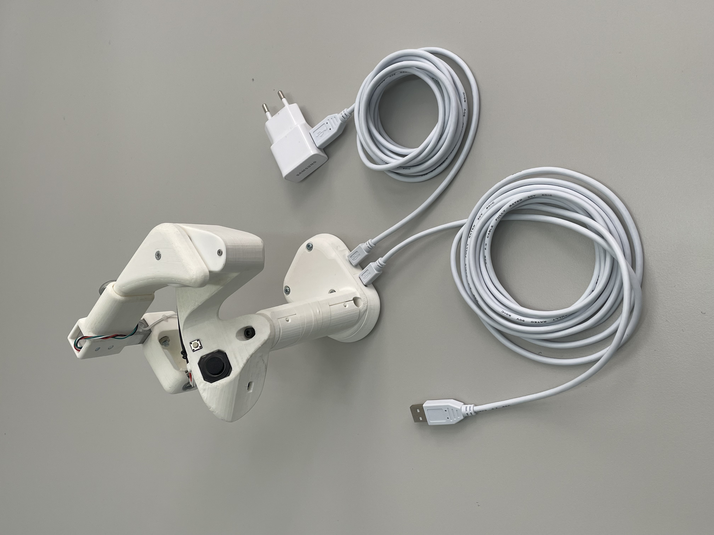

# CRAEFT Controller 

Haptic controller project page

* [STL_files](STL_files) : 3D printing models
* [PCB](PCB): PCB design files (KiCAD 8.0)
* [Test_code](Test_code): calibration and code to test proper controller assembly
* [CRAEFT_controller_fw](CRAEFT_controller_fw): controller code



## How to use 
* plug in, A, plug in B, etc. [ Optional: illustrate wiring]
* Open Arduino IDE, Serial port at any baudrate, line termination etc.

> Careful! don't do *something*, it will damage the controller

* Use the serial port to: 
    * Send commands to the controller 
    * Receive information from the controller at 100Hz: the format is
```
    <mode><target object angle><PID set Angle> <light_sensor_value> <current force> <stiffness> <thumbstick Y> <thumbstick X>
```
* Mode:
    * Mode 0 : DISABLED MODE
    * Mode 1 : PINCHING MODE - force control
    * Mode 2 : TOUCHING MODE - position

**List of commands**

|Command| Acceptable values|Definition|Example|
|:---:|:---:|:---:|:---:|
| A |0 to 50 |update  `setAngle` |A20 : puts set angle at 20 degrees|
| O |0 to 50 |update  `objectAngle` |O25 : puts object angle at 30 degrees|
| Z | - | tare the loadcell| let the Index finger go and send "Z" to reset measured force to 0|
| etc | etc | etc | etc |


**Angle definition** 

<Insert image here to show what is 0 and what is 50, no need to mention servo angles>

## System block diagram
<Insert diagram that shows what is where and how it is controlled - simple version>

## Documentation todo
- [ ] Upload zip file with all the STL files used in STL files folder
- [ ] Correct PCB design so that someone can order a new PCB that doensn't need twaeking
- [ ] Upload zip file of Kicad PCB project in the PCB folder
- [ ] Upload schematic PDF in PCB folder
- [ ] Upload Bill of Materials .csv file in the main repository, with all the components used and links when makes sense
- [ ] Add images to this readme, you can upload them in the folder <Images> and link to them
- [ ] Write a better how to use section, complete it. 
- [ ] Complete the list of commands in the table
- [ ] Complete format of the information the controller sends back 
- [ ] Add angle definition image 
- [ ] Add block diagram to explain the controller components
- [ ] Finish assembling and labelling both controllers
- [ ] Test code on both controllers
- [ ] Test added feature: enable/disable mode switching based on thumb placement. Default is off. Make sure to set a threshold that works with both controllers. 
- [ ] Reassemble Quest controller
- [ ] Check with Christian if we send both controllers or only one
- [ ] Prepare box to ship Controller(s) + Quest controller
