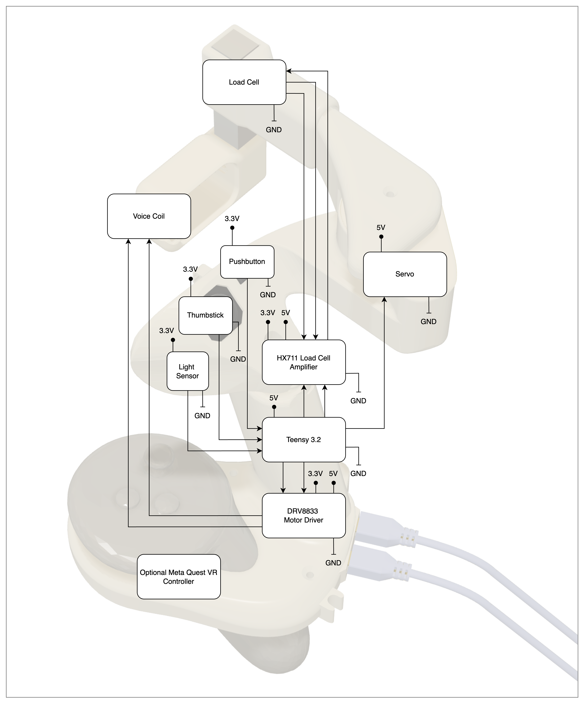

# CRAEFT Controller 

Haptic controller project page

* [STL_files](STL_files) : 3D printing models
* [PCB](PCB): PCB design files (KiCAD 8.0)
* [Test_code](Test_code): calibration and code to test proper controller assembly
* [CRAEFT_controller_fw](CRAEFT_controller_fw): controller code

## Description


## How to use 
* Plug in USB cables A and B as shown. A red LED will indicate that the controller is receiving power

* Optionally, if using a Meta Quest 3, insert the right hand Quest controller into the controller adapter. 


 


* Open Arduino IDE, Serial port at any baudrate, line termination etc.


* Use the serial port to: 
    * Send commands to the controller 
    * Receive information from the controller at 100Hz: the format is

```
    <mode><target object angle><PID set Angle> <light_sensor_value> <current force> <stiffness> <thumbstick Y> <thumbstick X>
```
* Mode:
    * Mode 0 : DISABLED MODE
    * Mode 1 : PINCHING MODE - force control
    * Mode 2 : TOUCHING MODE - position

**List of commands**

The following commands can be sent to the controller to change its opearting mode, the angle of the servo arm, and the haptic vibration pattern.

|Command| Acceptable values|Definition|Example|
|:---:|:---:|:---:|:---:|
| M | T, P, D | change `op_mode` | MT : puts the controller in TOUCHING MODE |
| A |0 to 50 |update  `setAngle` |A20 : puts set angle at 20 degrees|
| O |0 to 50 |update  `objectAngle` |O25 : puts object angle at 30 degrees|
|F |0 to 15000|haptic vibration frequency | F800 : sets the haptic vibration to 800Hz|
|P|0 to 150|haptic vibration amplitude | sets the strength of the haptic vibration| P200 : sets the haptic vibration amplitude to 200|
| L | 0 or 1 | allows controller to switch to pinching mode if the light sensor is covered | L1 : activates this function |

**Servo arm range** 

Illustration of what is meant by the previously mentioned angles. The maximum angle, 50 by default, can be configured if needed by changing the global variable `SERVO_ANGLE_MAX`
(such as for users with smaller hands).


## System block diagram


## Documentation todo
- [x] Upload zip file with all the STL files used in STL files folder
- [x] Correct PCB design so that someone can order a new PCB that doensn't need twaeking
- [x] Upload zip file of Kicad PCB project in the PCB folder
- [x] Upload schematic PDF in PCB folder
- [x] Upload Bill of Materials .csv file in the main repository, with all the components used and links when makes sense
- [x] Add images to this readme, you can upload them in the folder <Images> and link to them
- [x] Write a better how to use section, complete it. 
- [x] Complete the list of commands in the table
- [x] Complete format of the information the controller sends back 
- [x] Add angle definition image 
- [ ] Add block diagram to explain the controller components
- [x] Finish assembling and labelling both controllers
- [x] Test code on both controllers
- [x] Test added feature: enable/disable mode switching based on thumb placement. Default is off. Make sure to set a threshold that works with both controllers. 
- [x] Check with Christian if we send both controllers or only one
- [x] Prepare box to ship Controller(s) + Quest controller
